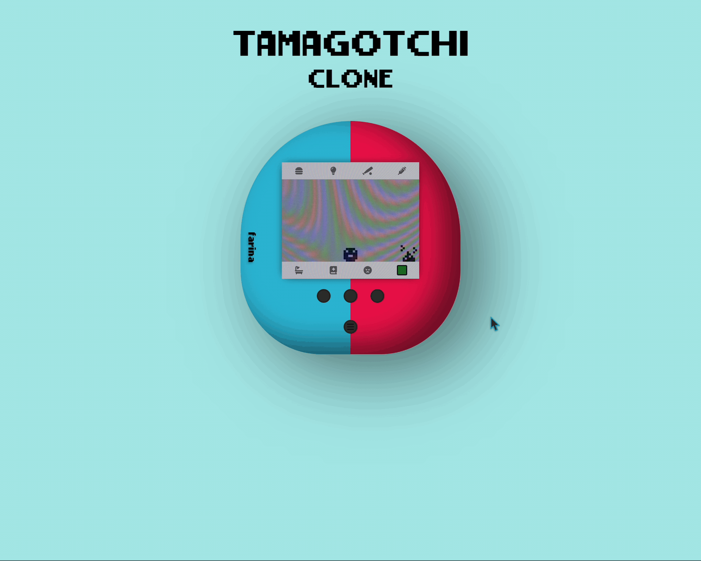

| [[soundScapes]]()  | [Tamagotchi]() | First Header  | Second Header |
| ------------- | ------------- | ------------- | ------------- |
|  |   | Content Cell  | Content Cell  |

<!-- | First Header  | Second Header |
| ------------- | ------------- |
| Content Cell  | Content Cell  | -->

  

 

<!-- MarkDown Icons -->
<!-- https://github.com/Ileriayo/markdown-badges -->
